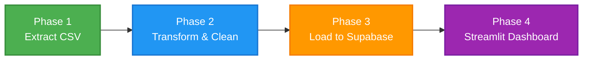
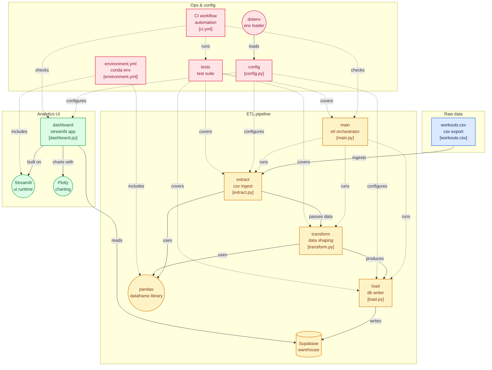

<div align="center">
  <h1>🏋️ Hevy Flow</h1>

  <p><strong>An end-to-end Data Engineering ETL pipeline for Hevy workout logs.</strong></p>

  
  
  
  
  
  

</div>

<br/>

Extracts workout logs from the [Hevy](https://www.hevyapp.com/) fitness tracking app, transforms and cleans the raw data, loads it into a **Supabase (PostgreSQL)** database, and presents insights through an interactive **Streamlit** dashboard.

---

## 🛠️ Tech Stack

**Core Libraries & Tools:**
* **Language:** Python 3.12
* **Environment:** Conda (`environment.yml`)
* **Data Processing:** `pandas` for ETL transformations
* **Database:** Supabase (PostgreSQL)
* **DB Adapter:** `psycopg2-binary`
* **Visualization:** Streamlit & Plotly Express/Graph Objects
* **Config Management:** `python-dotenv`

---

## 🏗️ Architecture

### High-Level Flow

---

### Detailed Pipeline Flow


## 📂 Project Structure

```text
hevy-flow/
├── data/
│   └── workouts.csv          # Raw Hevy export
├── etl/
│   ├── __init__.py
│   ├── extract.py            # Phase 1: CSV extraction & validation
│   ├── transform.py          # Phase 2: Cleaning & transformations
│   └── load.py               # Phase 3: Supabase loader
├── dashboard.py              # Phase 4: Streamlit analytics dashboard
├── config.py                 # Centralized configuration
├── main.py                   # Pipeline entry point
├── environment.yml           # Conda environment
├── .env.example              # Environment variable template
├── .gitignore
└── README.md
```

---

## 💻 Setup & Usage

### 1. Prerequisites

- [Conda](https://docs.conda.io/en/latest/miniconda.html) (Miniconda or Anaconda)
- A [Supabase](https://supabase.com/) project (free tier works)

### 2. Installation

```bash
# Clone the repository
git clone https://github.com/your-username/hevy-flow.git
cd hevy-flow

# Create and activate the Conda environment
conda env create -f environment.yml
conda activate hevy-flow

# Configure environment variables
cp .env.example .env
# Edit .env with your Supabase credentials
```

### 3. Running the Data Pipeline

```bash
python main.py
```

### 4. Launching the Dashboard

```bash
streamlit run dashboard.py
```
